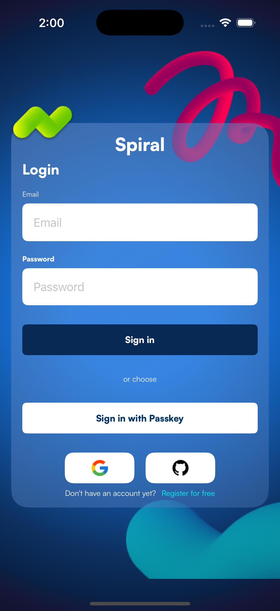
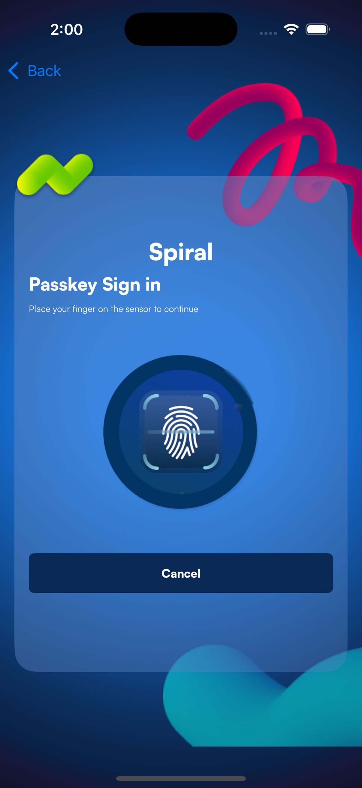
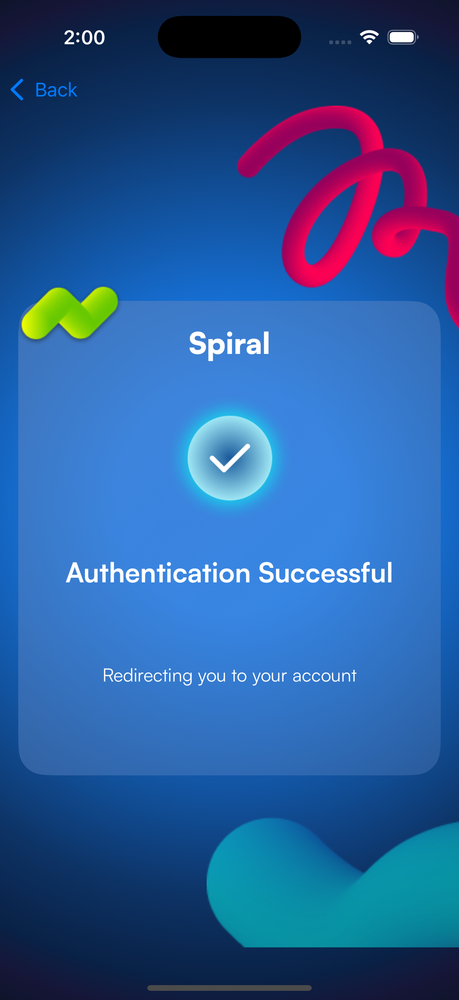
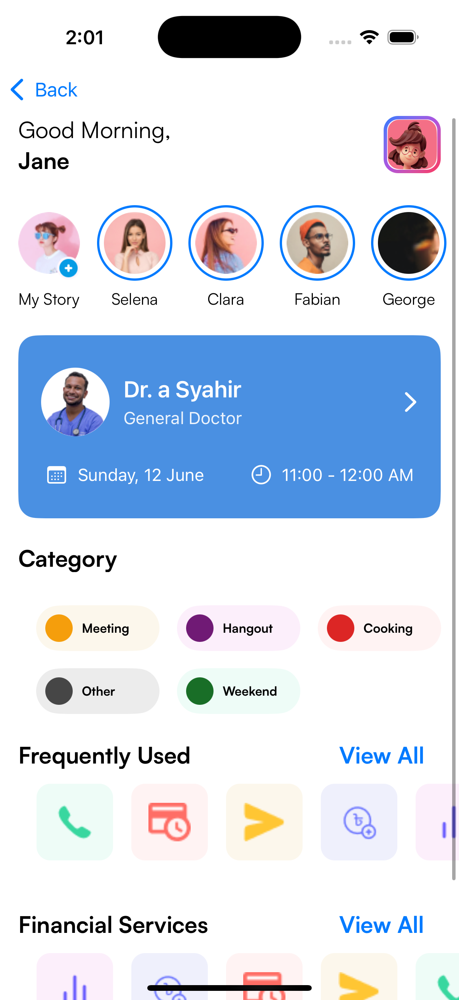
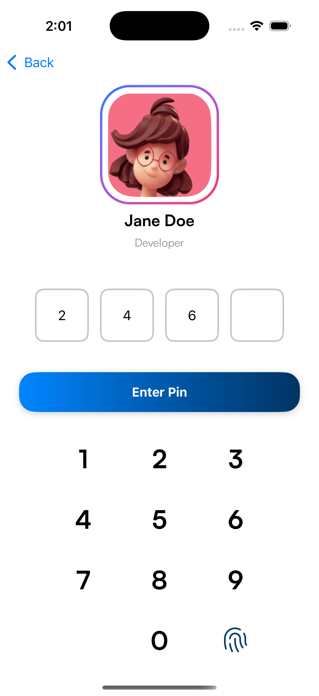
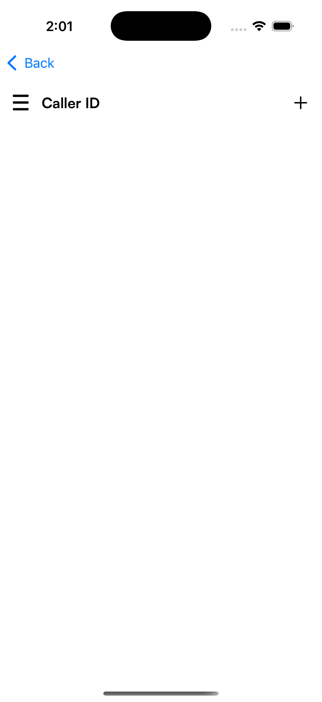
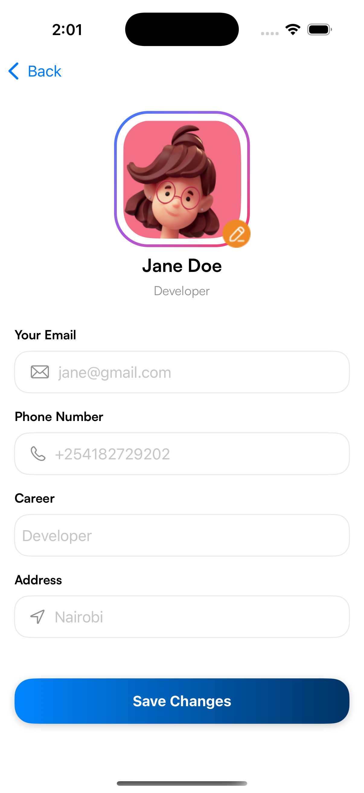

# Spiral

## Description
Spiral is a SwiftUI iOS application.

## Figma Link
Link: [https://www.figma.com/file/2oxs5W7sNoECiWePB5iY5f/Developer-Assesment?node-id=0-1](https://www.figma.com/file/2oxs5W7sNoECiWePB5iY5f/Developer-Assesment?node-id=0-1)

## Project Structure

- `Views/`: Main Screens
  - LoginView
  - DashboardView
  - EditProfileView
  - PassKeyView
  - CallerIDView
  - SuccessView

- `Components/`: Reusable UI components
  - AppointmentCard
  - IconView
  - ProfileCircle
  - TagView

- `Constants/`: App-wide constants and styles
  - Font definitions
  - Button styles
  - Color schemes

## Screenshots

<p float="left">
  
   
  
  
  
  
  
</p>

## Getting Started

1. Clone the repository
```bash
git clone https://github.com/kraazie/spiral.git
```
2. Open Spiral.xcodeproj in Xcode
3. Build and run the application

## Requirements
- iOS 15.0+
- Xcode 14.0+
- Swift 5.0+

## Contributing
1. Fork the project
2. Create your feature branch (`git checkout -b feature/AmazingFeature`)
3. Commit your changes (`git commit -m 'Add some AmazingFeature'`)
4. Push to the branch (`git push origin feature/AmazingFeature`)
5. Open a Pull Request

## License
This project is licensed under the MIT License - see the LICENSE file for details

## Contact
Ali Ghani - [@kraazie](https://github.com/kraazie)

Project Link: [https://github.com/kraazie/spiral](https://github.com/kraazie/spiral)
